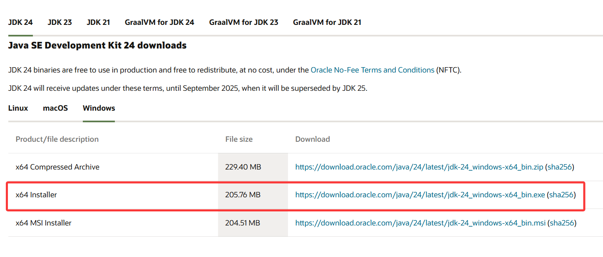
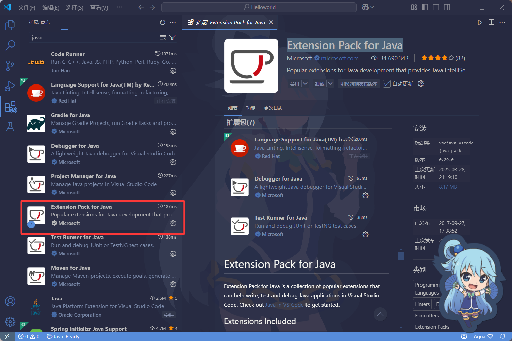
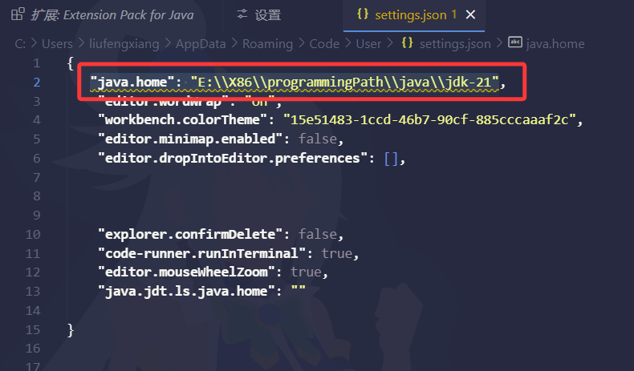

# 环境配置

## java环境配置

### 前言

> 所需网址
>
> oracle 
>
> 官网 https://www.oracle.com/cn/
>
> vscode
>
> 官网 https://code.visualstudio.com/

### 在vscode中配置Java环境

1.打开oracle官网，在首页中**产品>硬件和软件>Java**

在新开页中**下载Java>选择版本>Windows**

下载后除了更换下载路径，默认即可

2.下载vscode，选择扩展输入Java

下载Extension Pack for Java这是一个整合包，尝试创建一个Java文件可能会爆出一个无法找到jdk的错误，可能的解决方法：**打开设置搜索java.home**

点击上图打开.json后缀的文件，在此文件中输入**"java.home"**: "E:\X86\programmingPath\java\jdk-21"**

上图，路径是安装Java的路径

---

